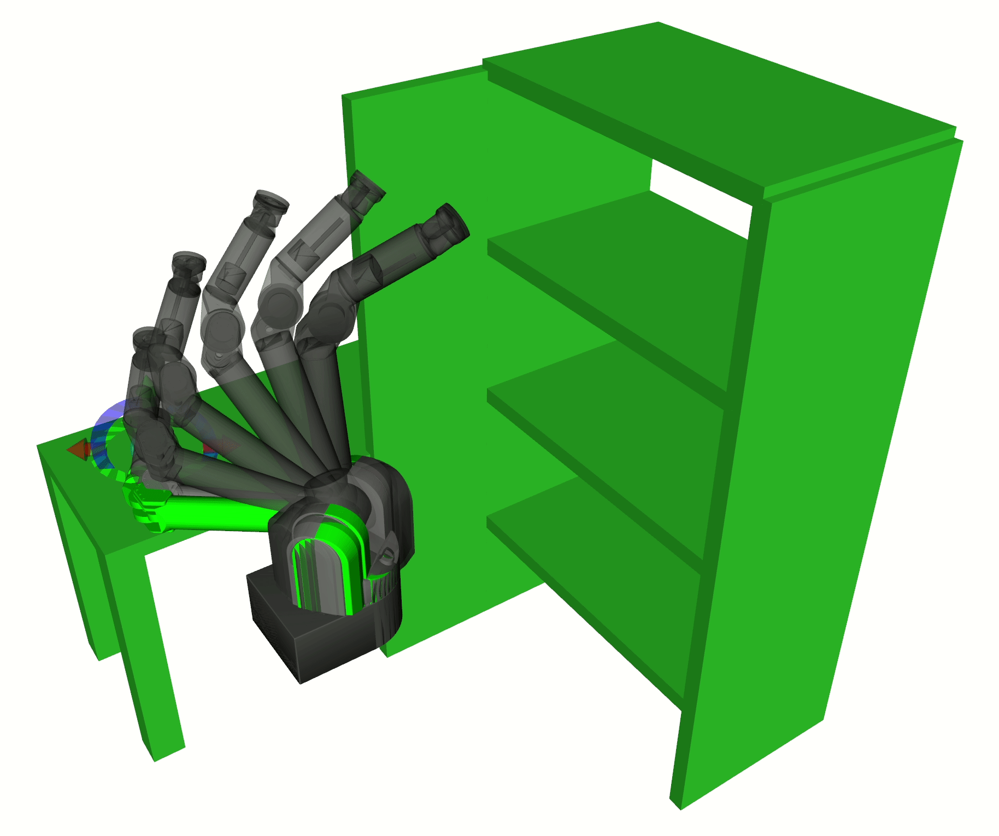

# Stochastic motion planning as Gaussian Variational Inference

This repository is dedicated to implementing Gaussian Variational Inference Motion Planning algorithms (GVIMP). GVIMP was introduced in the following work: 
**[A Gaussian Variational Inference Motion Planning](https://arxiv.org/abs/2209.05655)**, 
and the details and complete proofs are included in the work 
**[Stochastic Motion Planning as Gaussian Variational Inference: Theory and Algorithms](https://arxiv.org/abs/2308.14985)**. 
The latter work also showed the equivalence between the GVI-MP and a classical stochastic control problem. Leveraging the duality between inference and stochastic control, we present another algorithm in the latter paper, namely Proximal Gradient Covariance Steering Motion Planning (PGCS-MP). 

## Planning-as-inferencec
The motion planning problem can be formulated as a probability inference, and the (sub-) optimal trajectory is modeled as a posterior probability $p(X|Z)$, $X$ being the trajecotry, and $Z$ is the environment, often represented by the joint space with obstacles. In this thread of research we use **[GaussianVI](vimp/gvimp/README.md)** to find a Gaussian distribution that is closest to the posterior. We can then sample from the solved Gaussian distribution.

## Examples

**Safe and robust motion planning: Entropy maximization formulation**

In a senario with a narrow gap existed between 2 obstacles, classical deterministic motion planner will find a plan that is short, but risky. Our method is equivalently entropy-regularized motion planning. The objective in the stochastic optimal control problem, $\mathbb{E}_q [J(q)]$, is regularized by the entropy of the trajectory joint distribution $H(q)$. The objective we are maximizing is
$$\mathbb{E}_q [J(q)] + H(q).$$

A higher entropy will trade off the short distance risky plan, and gives a longer but safer motion plan. On the right-hand side in the figures below is one illustrative example of this idea.


**Variational Mmotion planning for a 7-DOF WAM robot arm**

Our method leverages the factor graph structure of the probabilistic motion planning formulation, and the closed-form expressions for Gaussian posterior expectation computations that does not need other expectation techniques such as Gauss-Hermite quadratures. These structures helped our method to be scalable to higher DOF system such as a industrial robot arm. 

In a bookshelf senario below, the animated trajectory is the mean of the trajectory distribution obtained from GVI-MP and PGCS-MP planner, represented by dark gray and silver color, respectively.

 

 


## Dependencies
1. Boost \
Download **[Boost1.78.0](https://github.com/boostorg/boost/releases/tag/boost-1.78.0)**, install, and change the **BOOST_ROOT** variable in the root **[CMakeLists.txt](https://github.com/hzyu17/VIMP/blob/master/CMakeLists.txt)** file. \
To build Boost in a customized location: **[check this link](https://github.com/hzyu17/technicals/tree/main/C%2B%2B)**

2. **[Eigen 3.4.0](https://gitlab.com/libeigen/eigen/-/releases/3.4.0)**

3. **[OpenMP](https://www.openmp.org/)**
```
sudo apt-get install libomp-dev
```

## Build and install VIMP
```
git clone https://github.com/lucasyu17/VIMP.git
cd VIMP
mkdir build && cd build
cmake .. 
sudo make install 
```

## 2D point robot example
To recover the 2D Point robot example in [1, 2], run the following:
```
cd VIMP
git checkout paper_experiment_results
mkdir build && cd build
cmake .. 
make
./src/gvimp/gvi_PointRobot_spgh 
```
The result can be visualized in matlab by running
```
/PathToVIMP/matlab_helpers/GVIMP-examples/2d_pR/planarPR_map2.m
```

## Repository structure
```
./vimp
├── 3rdparty : dependencies (gpmp2, Eigen, etc.)
├── CMakeLists_customize.txt (A CMakeLists.txt that allows to install to customized location)
├── CMakeLists.txt 
├── configs (Experiment configurations)
├── data 
├── dynamics (Abstract definition of dynamics)
├── gp (Gaussian process related code and definitions)
├── gvimp (Gaussian Variational Inference Motion Planning, abstract definitions)
├── helpers (Some helper classes and functions)
├── instances (Instances of the abstract algorithm definitions with specific Robot Model, Map, and Forward Kinematics)
├── maps (Predefined different maps, mostly borrowed from GPMP2, for the purpose of comparison)
├── pgcsmp (Proximal gradient Covariance Steering Motion Planning, abstract definitions)
├── README.md
├── robots (Robot with Map definitions, for the purpose of instantiate the abstract algorithms.)
├── scripts (ROS related python scripts)
├── src (Experiment executables)
└── tests

./matlab_helpers: This directory reads the results from the ./vimp/src experiment executables, analyze and plot the results.
```

## Citing
If you use this repository in your research, please cite the following publications:
```
@ARTICLE{10068240,
  author={Yu, Hongzhe and Chen, Yongxin},
  journal={IEEE Robotics and Automation Letters}, 
  title={A Gaussian Variational Inference Approach to Motion Planning}, 
  year={2023},
  volume={8},
  number={5},
  pages={2518-2525},
  doi={10.1109/LRA.2023.3256134}}
```
```
@misc{yu2023stochastic,
      title={Stochastic Motion Planning as Gaussian Variational Inference: Theory and Algorithms}, 
      author={Hongzhe Yu and Yongxin Chen},
      year={2023},
      eprint={2308.14985},
      archivePrefix={arXiv},
      primaryClass={cs.RO}
}
```
