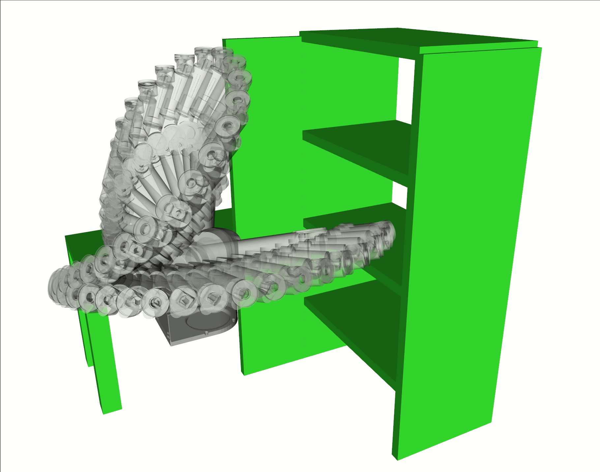
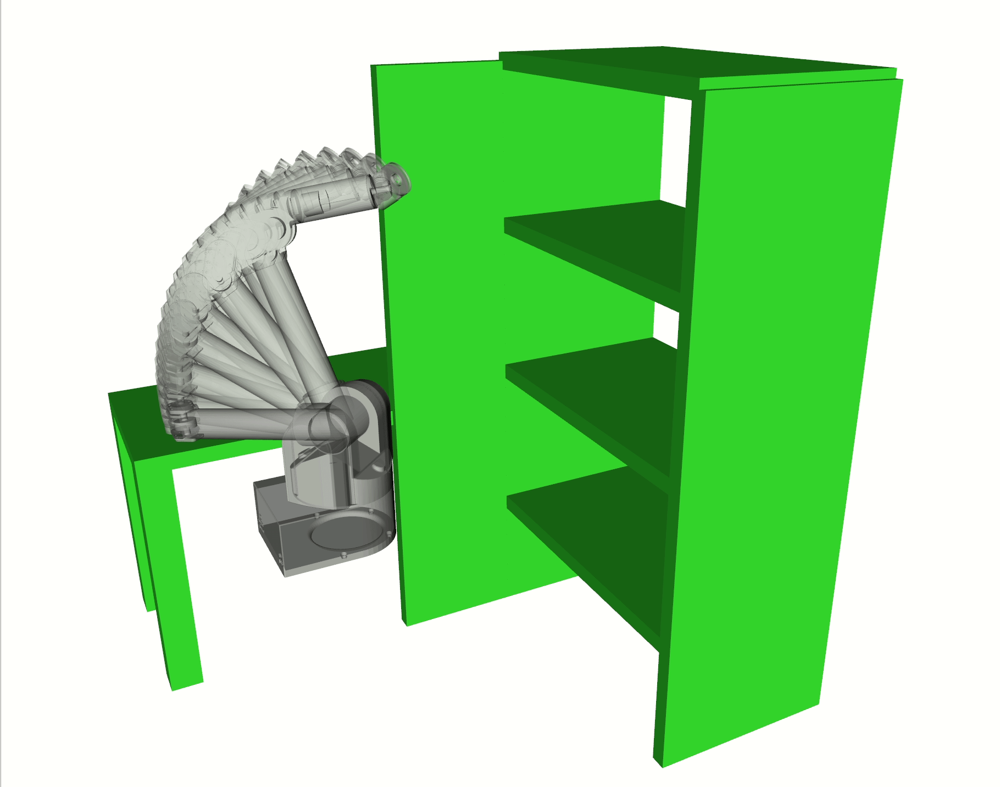

# Gaussian variational inference (GVI) motion planning.


VIMP uses Gaussian variational inference to approach the motion planning problem as a probability inference. This project is built upon GTSAM and GPMP2.



Motion planning for a 7-DOF WAM robot arm. The animated trajectory is the mean of the trajectory distribution obtained from PGCS-MP planner.

**Dependencies**
1. Boost: successful built with Boost1.78.0
Build Boost in a customized location: **[link](https://github.com/hzyu17/technicals/tree/main/C%2B%2B)**
Add library path to ld lib path:
```
export LD_LIBRARY_PATH=/usr/local/lib:$LD_LIBRARY_PATH
```
2. Eigen 3.4.0
**[Download Eigen source](https://gitlab.com/libeigen/eigen/-/releases/3.4.0)**
and 
```
cd eigen-3.4.0
mkdir build && cd build\
cmake -DCMAKE_INSTALL_PREFIX=prefix_path ..\
make install 

```
3. Matplot++
**[Matplot++](https://github.com/alandefreitas/matplotplusplus)**

4. GTSAM 
**Build GTSAM**
**[GTSAM](https://github.com/borglab/gtsam)**
 Build and installation:
 ```
 git clone https://github.com/hzyu17/gtsam.git 
 cd gtsam
 mkdir build && cd build
 cmake -DGTSAM_BUILD_PYTHON:=OFF -DGTSAM_INSTALL_MATLAB_TOOLBOX:=ON \
-DGTSAM_ALLOW_DEPRECATED_SINCE_V4:=OFF -DGTSAM_INSTALL_CYTHON_TOOLBOX:=OFF \
 -DGTSAM_USE_SYSTEM_EIGEN:=ON -DGTSAM_BUILD_UNSTABLE:=OFF -DGTSAM_WITH_TBB:=OFF .. 
 sudo make install
 ```

5. GPMP2
**Build GPMP2**
**[GPMP2](https://github.com/gtrll/gpmp2)**
Build and installation:
 ```
 git clone https://github.com/hzyu17/gpmp2.git
 cd gpmp2 && mkdir build && cd build\
 cmake -DGPMP2_BUILD_PYTHON_TOOLBOX:=OFF -DGPMP2_BUILD_MATLAB_TOOLBOX:=ON .. 
 sudo make install 
 ```

**Build and install VIMP**
```
git clone https://github.com/lucasyu17/VIMP.git
mkdir build && cd build\
cmake .. 
sudo make install 
```


## If build with a customized install location and boost library:
1. GTSAM
```
cmake -DCMAKE_INSTALL_PREFIX=/PREFIX -DGTSAM_BUILD_PYTHON:=OFF -DGTSAM_BUILD_MATLAB:=ON -DGTSAM_INSTALL_MATLAB_TOOLBOX:=ON -DGTSAM_ALLOW_DEPRECATED_SINCE_V4:=ON \
-DGTSAM_INSTALL_CYTHON_TOOLBOX:=OFF  -DGTSAM_USE_SYSTEM_EIGEN:=ON -DCMAKE_PREFIX_PATH=/PREFIX -DBOOST_ROOT=/PREFIX/bin/boost -DBOOST_INCLUDEDIR=/PREFIX/bin/boost/include \
-DBOOST_LIBRARYDIR=/PREFIX/bin/boost/lib -DBoost_NO_BOOST_CMAKE=TRUE -DGTSAM_WITH_EIGEN_MKL=OFF -DGTSAM_WITH_TBB=OFF ..
```
2. GPMP2
```
cmake -DCMAKE_INSTALL_PREFIX=/PREFIX -DGPMP2_BUILD_MATLAB_TOOLBOX:=ON \
-DCMAKE_PREFIX_PATH=/PREFIX -DBOOST_ROOT=/PREFIX/bin/boost \
-DBOOST_INCLUDEDIR=/PREFIX/bin/boost/include \
-DBOOST_LIBRARYDIR=/PREFIX/bin/boost/lib -DBoost_NO_BOOST_CMAKE=TRUE ..
```

## Run Tests
All changes to the code should pass the current tests. To run all the tests:
```
cd path_to_vimp
python scripts/run_all_tests.py
```

## Citation
If you use this repository in your research, please cite the following publications
```
@ARTICLE{10068240,
  author={Yu, Hongzhe and Chen, Yongxin},
  journal={IEEE Robotics and Automation Letters}, 
  title={A Gaussian Variational Inference Approach to Motion Planning}, 
  year={2023},
  volume={8},
  number={5},
  pages={2518-2525},
  doi={10.1109/LRA.2023.3256134}}
```
