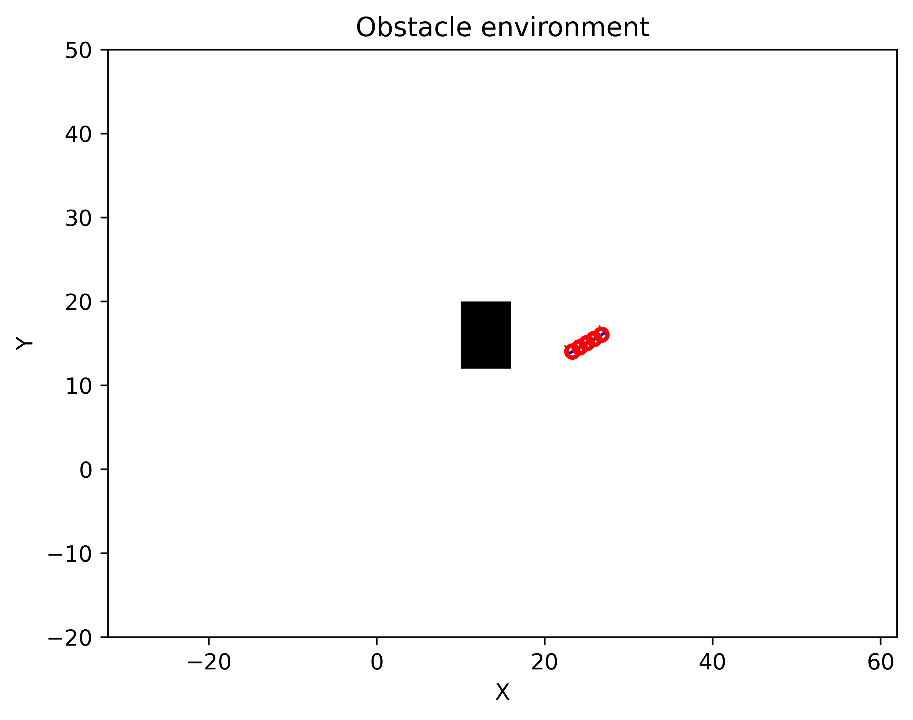

## A simple Signed Distance Field(SDF) for use in robotics 
Stand-alone python wrap of signed distance field and collision cost implementations for applications in robotics.

## Dependencies
**[Eigen 3.4.0](https://gitlab.com/libeigen/eigen/-/releases/3.4.0)**, **[Pybind11](https://github.com/pybind/pybind11)** ,numpy, scipy, plotly.

## Build shared library
```
git clone https://github.com/hzyu17/sdf_robot.git
cd sdf_robot
mkdir build && cd build
cmake ..
make
```
## Tests
```
cd tests
pytest
```
## Examples 
For collision checking on a multi-body robot, a vector of collision checking points in different locations are considered in the workspace. 

Each collision checking point is forward transformed to the workspace. A signed distance to the obstacles is first computed elementwise, and then a hinge loss is applied to the signed distance. Finally, a norm weighted by $\Sigma_{\rm obs}$ represents the collision cost. 

We define the forward chain as $\mathbf{h}(S(F(X_t)))$, $\mathbf{h}(\cdot)$ is a hinge loss function, $S(\cdot)$ is the signed distance to the obstacles, $F(\cdot)$ represents the forward kinematics for the collision-checking positions, and $\Sigma_{obs}$ is a weight applied on the hinge losses, and the collision cost function is defined as 
$$ V(X_t) = \left\lVert \mathbf{h}(S(F(X_t))) \right\rVert_{\Sigma_{\text{obs}}}^2. $$

The gradient $\partial_x V$ can be obtained from the chain rule where each chain has a predefined closed form or can be computed using finite difference. 

Below is an example of a planar quadrotor with multiple collision-checking points in a planar sdf with one obstacle.

